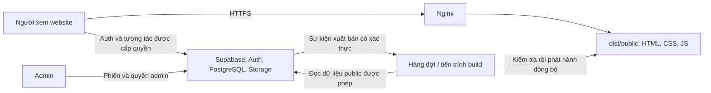

# Mã 01 — Quyết định kiến trúc và kiểm kê phụ thuộc

Ngày: 10/09/2026. Phạm vi được duyệt: chốt kiến trúc, kiểm kê server cũ và dọn tham chiếu legacy không dùng. [Danh sách và trạng thái duyệt](launch-checklist.md).

**Kết quả:** đã chốt kiến trúc và hoàn tất kiểm kê nguồn. Không tìm thấy luồng frontend gọi API C#/PowerShell/Express hoặc đọc `database.json`/`data.json` trực tiếp. Hằng `API_BASE_URL` duy nhất trong `admin.js` không có nơi sử dụng và đã được xóa. Đây chưa phải nghiệm thu browser/API live hay xác nhận có thể mở production ngay.

## Quyết định

1. Giữ HTML, JavaScript và giao diện hiện có; không chuyển toàn site sang framework mới trong giai đoạn này.
2. Supabase PostgreSQL là nguồn dữ liệu chính; Supabase Auth quản lý danh tính/phiên; Storage lưu ảnh và tài liệu với quyền phù hợp.
3. Nginx trên VPS chỉ phục vụ artifact `dist/public/` do build tạo, xử lý HTTPS, URL chuẩn, redirect, cache và HTTP 404.
4. Tiến trình build dùng Node.js, sinh HTML public và từng dự án published trước khi phục vụ. Node dùng cho build/job nội bộ, không khởi chạy backend `server/` hiện tại. Phiên bản runtime/dependencies sẽ được khóa khi làm mã 03.
5. Frontend gọi Supabase qua `SupabaseService` cho tương tác. Tiến trình xuất bản chỉ lấy dữ liệu/trường được phép công khai; ưu tiên API chỉ đọc theo RLS, không xuất bảng nguyên trạng bằng khóa đặc quyền.
6. Những thao tác cần đặc quyền, nếu thực sự cần, dùng Edge Function/API hẹp kiểm tra người gọi và role phía server; không đưa secret/service-role vào trình duyệt.
7. Chỉ thêm gateway trước Nginx cho HTML riêng tư nếu người dùng duyệt yêu cầu đó ở 06B. Auth/RLS vẫn bắt buộc bảo vệ dữ liệu dù HTML shell có thể tải công khai.

## Luồng đích (chưa triển khai build/Nginx)

Sự kiện build, hàng đợi, retry, trạng thái xuất bản và xử lý unpublish thuộc mã 07. Nội dung public không phụ thuộc vào việc bot chạy JavaScript; tương tác bổ sung vẫn dùng JS. Không render một phiên bản riêng chỉ dành cho bot.

## Bảng giữ / bỏ / chuyển

| Thành phần hiện tại | Kết quả kiểm kê | Quyết định / mã thực thi |
|---|---|---|
| `assets/js/supabase-service.js` | REST `/rest/v1`, Auth `/auth/v1`, Storage `/storage/v1`; không có fallback API local | Giữ; rà quyền/hàm legacy tại 05, dữ liệu public/build tại 07 |
| `assets/js/supabase-config.js` | Cấu hình kết nối frontend | Giữ public config; secret được kiểm kê riêng ở 02 |
| `main.js`, `admin.js`, recovery/register scripts | Các luồng dữ liệu chính gọi SupabaseService | Giữ; đã xóa hằng API localhost không dùng |
| HTML, `components/`, CSS, font, ảnh | Frontend hiện tại; navbar/footer và template SPA còn fetch cùng origin | Giữ; đóng gói theo allowlist ở 03, tối ưu 08 |
| `ApiServer.cs`, `ApiServer.exe` | API `/api/v1`, database JSON local, phục vụ file; mã C# tham chiếu đường dẫn máy cũ | Legacy, không thuộc kiến trúc đích; không chạy hoặc biên dịch lại để triển khai |
| `WebServer.cs`, `WebServer.exe` | Phục vụ file và rewrite route; mã nguồn tham chiếu đường dẫn máy cũ | Thay bằng Nginx ở 04; chưa xóa binary/source |
| `server.ps1`, `server2.ps1`, `server_5500.ps1` | Server HTTP/TCP tự viết; bản 5500 có route friendly | Thay bằng preview/Nginx ở 03/04; không dùng trên VPS |
| `server/` Express/TypeScript | API Auth/CRUD/upload độc lập; `db.ts` đọc database JSON, không phải Supabase PostgreSQL | Không cài/chạy trong kiến trúc đích; giữ để đối chiếu |
| `database.json`, `data.json` | Không có tham chiếu đọc từ frontend đã quét; API C# có dùng JSON local | Không dùng làm nguồn production; kiểm kê dữ liệu cần giữ trước khi xóa ở 02/03/05 |
| `sync.js` | Script Node sửa hai nhóm HTML trong homepage bằng fs | Công cụ chỉnh HTML cũ, không phải đồng bộ database; không chạy trong build đích |
| `supabase*.sql`, log, tài liệu kế hoạch | Công cụ nội bộ, chưa có ranh giới web root riêng | Không xuất public ở 03; không chạy schema/migration trong 01 |
| Các trang `admin-*.html` rời | Có trang chuyển sang SPA và trang UI rời; không có API local trong nguồn đã quét | Mã 03 lập allowlist/redirect từng trang; 06B xử lý auth/noindex; chưa xóa hàng loạt |
| `implementation_plan.md`, `finalize_plan.md` | Kế hoạch cũ có hướng Express/PostgreSQL tự quản và đường dẫn cũ | Lưu làm lịch sử, thêm thông báo được thay thế bởi quyết định này |

“Không thuộc bản triển khai đích” là quyết định thiết kế. Chưa có artifact/Nginx để xác minh việc loại file trên HTTP; server cũ vẫn còn trên đĩa. Không khẳng định binary `.exe` đồng bộ với source và không chạy binary để kiểm tra.

## Ma trận chức năng và nguồn dữ liệu

| Luồng | Bằng chứng nguồn | Nguồn đang gọi / kết luận |
|---|---|---|
| Trang chủ, danh sách, chi tiết dự án | `main.js`: `loadLiveProjects`, `loadProjectDetails`; service: `getProjects`, `getProject` | Supabase `projects`; draft hiện còn lọc ở client, cần 05 |
| Quản trị dự án | `admin.js`: `loadAllAdminData`, `addProject`, `updateProject`, `deleteProject`, `updateProjectDetails` | Supabase; không gọi API server cũ |
| Upload hero/gallery/mặt bằng | Service `uploadProjectImage`; admin `uploadProjectImageOrThrow` | Supabase Storage bucket `project-images`; quyền live chưa kiểm tra |
| Tài liệu, bộ biểu mẫu, hướng dẫn | Service `getDocuments`, `addDocument`, `updateDocument`, `deleteDocument`, `uploadDocumentFile` và caller admin/main | Supabase `documents` + Storage; URL file public/private cần rà 05 |
| FAQ | `getFaqs`, `addFaq`, `updateFaq`, `deleteFaq` và caller admin/main | Supabase `faqs` |
| Đăng nhập/đăng ký/đăng xuất | Service `signInWithPassword`, `signUpWithPassword`, `signOut`; main và admin-login | Supabase Auth; admin/user có khóa phiên trình duyệt riêng |
| Reset password | `recover-password.js`; `requestPasswordReset`, `verifyRecoveryOtp`, `updateAuthPassword` | Supabase Auth; chưa gửi email thật trong 01 |
| Profile và user list | `getCurrentProfile`, `getUsers`, `updateOwnProfile`, `updateUser` | Supabase `users` liên kết `auth_user_id`; không đồng nhất mọi thao tác profile với quản lý Auth |
| Lưu/theo dõi dự án | `getSavedProjects`, `setProjectSaved`, `getFollowedProjects`, `setProjectFollowed` | Supabase `user_saved_projects` / `user_followed_projects` |
| Checklist đăng ký theo dự án | `register-steps.js`: `noxh_register_steps_*`, `persist` | Trạng thái tiến độ còn localStorage, thông tin dự án đọc Supabase; chưa có đồng bộ đa thiết bị |
| Thống kê lượt truy cập/thời lượng/bounce | Đầu `main.js`; `admin.js`: `loadDashboardMetrics`, `prepareChartData` | localStorage của trình duyệt, không phải analytics toàn site; xử lý 10 |
| Phản hồi/hỗ trợ | `main.js`: `submitFeedback`; admin kiểm tra `getFeedbacks` nhưng service không định nghĩa | Form chỉ đổi UI thành công, chưa gửi/lưu phản hồi; không phải chức năng server cũ đang hoạt động |
| Tin tức | Service có CRUD news nhưng `loadAllAdminData` comment lời gọi `getNews`; không thấy caller CRUD từ UI | Chưa nối đầy đủ UI với persistence; không kết luận news đã hoạt động |

Các tên hàm là điểm tìm bằng `rg`, không phải kết quả browser hoặc API production. URL ảnh/tài liệu nhận từ Supabase live vẫn có thể trỏ hệ thống cũ; chưa đọc dữ liệu live để loại trừ khả năng này. Mã 05 phải thống kê host/đường dẫn file và lập chuyển dữ liệu nếu có.

## Các phát hiện cần chuyển tiếp, chưa tự mở rộng phạm vi

| Mã phát hiện | Vấn đề | Nơi xử lý / trạng thái |
|---|---|---|
| A01 | Chính sách công khai cần lọc draft tại database; slug hiện sinh từ tên | 05B đã chuẩn bị cột/policy draft; chờ kiểm thử staging, slug thuộc 07 |
| A02 | Admin tự gọi `migrateLegacyProjectStatuses` và `ensurePersistentProjectCodes` khi tải dữ liệu; mở admin không thuần đọc | 05: chuyển tác vụ di trú sang quy trình có kiểm soát; 01 không đăng nhập admin live để tránh ghi ngoài ý muốn |
| A03 | `resetPasswordByEmail` legacy PATCH `password_hash`; `addUser/deleteUser` thao tác profile, không quản lý Supabase Auth; chưa thấy caller các hàm này trong UI đã quét | 05B đã xóa reset profile và tạo `default_hash`; migration chuẩn bị bỏ cột legacy sau backup 05C |
| A04 | Phản hồi báo thành công nhưng không lưu/gửi; news UI chưa nối đầy đủ | Cần người dùng duyệt bổ sung chức năng hoặc tạm ẩn trước launch; 09 ghi là khoảng trống chức năng, chưa sửa trong 01 |
| A05 | Checklist/nhắc tiến độ local và analytics local | Checklist đa thiết bị cần duyệt riêng nếu muốn; analytics thuộc 10 |
| A06 | Live file URLs và dữ liệu JSON cũ chưa đối soát | 05 trước khi xóa legacy hoặc chuyển file Storage |
| A07 | Tài liệu cấu hình cũ có thể khiến triển khai nhầm backend Express | Đã thêm chỉ dẫn tài liệu mới; public allowlist sẽ cưỡng chế ở 03 |
| A08 | `assets/js/admin-pages/admin-dashboard-3.js` bị cắt ở dòng 27, lỗi `Unexpected end of input`; file hiện tại trùng Git HEAD, có từ trước lần sửa này. Trang `admin-dashboard.html` có redirect sang SPA nhưng vẫn tham chiếu script lỗi | 03: xử lý trang legacy bằng redirect/allowlist và loại script không còn cần; 09 kiểm tra URL cũ. Không đánh dấu toàn bộ JS đã đạt |

## Cách phát triển, build và triển khai

### Hiện tại sau mã 01

- Chưa có build/preview mới ở root, chưa có `dist/public/`, chưa dựng Nginx; không cung cấp lệnh `npm run build` giả như thể đã triển khai.
- Đã phát hiện Node.js v24.19.0 trong môi trường hiện tại, có thể kiểm tra cú pháp bằng `node --check assets/js/admin.js`. Không suy ra máy VPS có runtime này.
- Nếu dùng VS Code Live Server để xem HTML hiện tại, chỉ coi là preview giao diện local. Nó không thay thế kiểm thử direct friendly URL/reload trên Nginx và không được mở repo ra Internet.
- Không chạy `server/package.json` để khởi động website mới; đó là backend JSON legacy. Không chạy SQL seed cũ như bước cài đặt tự động.

### Hợp đồng triển khai sau khi các mã được duyệt

1. **03:** thêm package/lockfile cho build độc lập với `server/`; quy định lệnh build và preview chỉ artifact; kiểm tra danh sách file xuất. Preview local phải có mapping route tương thích staging và giới hạn localhost.
2. **04:** Nginx staging phục vụ artifact bằng quyền chỉ đọc; HTTPS, access control staging, routing/status/headers/caches; không proxy `/api/v1` sang backend cũ.
3. **05:** RLS/Storage/Auth thực tế; tài khoản thử riêng, backup trước migration; dữ liệu staging tách production hoặc cơ chế thử được duyệt.
4. **06/07:** build nội dung public/SEO; publish HTML, sitemap và redirect cùng phiên bản; fail build thì giữ bản hợp lệ trước, riêng gỡ công khai phải thu hồi route ngay theo cơ chế được thiết kế.
5. **09:** kiểm tra network với backend cũ không được cài/chạy ở staging, thử thao tác thật trên dữ liệu thử và nghiệm thu routing bằng HTTP/browser.
6. **04C/09B:** phát hành production có rollback; không đưa DB/Auth/Storage về snapshot cũ chỉ để rollback frontend. Không khôi phục trang đã bị gỡ khi rollback.

## Điều kiện nghiệm thu và bằng chứng

- [x] Chốt kiến trúc Nginx + static build + Supabase; giới hạn Node ở build/job nội bộ.
- [x] Kiểm kê luồng frontend, server legacy, JSON local và chức năng còn thiếu.
- [x] Xác nhận hằng API localhost không có caller; xóa và tăng cache version admin từ 34 lên 35.
- [x] Ghi rõ server legacy không thuộc artifact đích, chưa xóa hoặc dừng tiến trình.
- [ ] Build allowlist và Nginx loại file legacy thực tế: mã 03/04.
- [ ] Browser/network khi server cũ vắng mặt; thao tác Auth/CRUD/upload bằng dữ liệu thử: mã 09 sau 03/04/05.
- [ ] Đối soát live asset URLs, RLS/Storage/Auth: mã 05.
- [ ] Xóa dữ liệu/binary/source legacy sau đối soát và nghiệm thu: cần duyệt phạm vi xóa cụ thể.

Kiểm tra cú pháp, tìm tham chiếu và `git diff --check` chỉ là xác minh local. Mã 01 đã có quyết định và kiểm kê; tiêu chí runtime của việc ngừng server cũ vẫn để mở, không gộp thành tuyên bố production sẵn sàng.

### Kết quả kiểm tra local ngày 10/09/2026

| Kiểm tra | Kết quả |
|---|---|
| `node --check assets/js/admin.js` sau thay đổi | Đạt |
| `node --check` 28 file JavaScript được Git theo dõi trong `assets/js` | 27 đạt; 1 lỗi có sẵn ở `admin-dashboard-3.js`, xem A08 |
| Hash file lỗi so với Git HEAD | Trùng; không phải lỗi phát sinh từ thay đổi 01 |
| Quét HTML/JS frontend cho localhost, `/api/v1`, server C#, JSON local và `sync.js` | Không còn tham chiếu sau khi xóa hằng không dùng; đây là quét nguồn, không phải log network |
| Liên kết Markdown local giữa README, kế hoạch và kiến trúc | Đạt |
| `git diff --check`, kiểm tra diff/status | Đạt whitespace; thay đổi giới hạn ở tài liệu và hằng/script version admin |
| Browser, email, upload, API có xác thực, Supabase live, Nginx/VPS | Chưa chạy trong 01 |

## Cơ sở kỹ thuật

- [Nginx: serving static content](https://nginx.org/en/docs/beginners_guide.html) — Nginx có thể phục vụ tài nguyên tĩnh; cấu hình cụ thể cần kiểm tra ở 04.
- [Supabase: securing your data](https://supabase.com/docs/guides/database/secure-data) — RLS/grants quyết định quyền dữ liệu, khóa đặc quyền chỉ ở backend.
- [Google: JavaScript SEO basics](https://developers.google.com/search/docs/crawling-indexing/javascript/javascript-seo-basics) — Google có thể chạy JS; pre-render giúp nội dung sẵn trong response và phục vụ bot không chạy JS.
